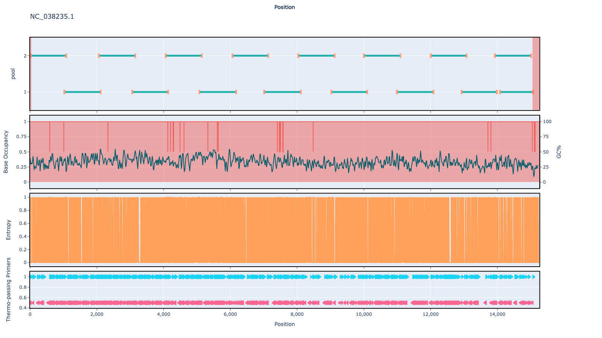

# sars-cov-2-rsv 1000bp v1.0.0

## Overviews




## Details

```json
{
    "ampliconsize": 1000,
    "schemeversion": "v1.0.0",
    "schemename": "sars-cov-2-rsv",
    "primer_bed_md5": "4858f0bb2ca29edc719963ff51e85cea",
    "reference_fasta_md5": "396d067a508ba862b8cad020e6241dcb",
    "status": "draft",
    "citations": [],
    "authors": [
        "artic network",
        "quick lab"
    ],
    "algorithmversion": "primalscheme3:1.0.1",
    "species": [
        2697049,
        208893,
        208895
    ],
    "license": "CC BY-SA 4.0",
    "primerclass": "primerschemes",
    "infoschema": "v1.1.0",
    "description": null,
    "derivedfrom": null
}
```


------------------------------------------------------------------------

This work is licensed under a [Creative Commons Attribution-ShareAlike 4.0 International License](http://creativecommons.org/licenses/by-sa/4.0/) 

